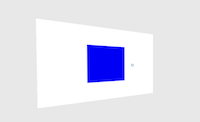

#aframe-react-canvas

A wrapper for HTML5 Canvas as a flat entity within AFrame, controlled by React.



Uses a hidden `<canvas>` element which pipes a `base64 png` url to a hidden `` element, which from there is rendered as a material onto an `<a-entity>`.

##Installation
`npm i aframe-react-canvas --save`

##Methods


| **Method** | **Use** |
| ---- | -------- |
| `.get()` | returns a standard `ctx` (2d context) object for html5 canvas |
| `.getFrame()` | returns the `base64` from the canvas, necessary in order to render onto the canvas itself. Resulting value should be passed into the `frame` prop (via state change). |

##Props

| **Prop** | **Use**| **Default** |
| ---- | ---- | ---- |
| `frame` | `base64` data which is returned from `.getFrame()`. Should be bound to a state in order to update. | the aframe logo |
| `width` | width in aframe units | `1` |
| `height` | height in aframe units | `1` |
| `depth` | depth in aframe units (not recommended unless a cube) | `0` |
| `resolution` | resolution of html5 canvas `(width/height * resolution = canvas width/height)` | `100` |
| `position` | position of canvas in 3d space. string-only. | `0 0 -1` |

##Example

Draws a blue square. Fully compatible with [ngokevin/aframe-react-boilerplate](https://github.com/ngokevin/aframe-react-boilerplate).

```
import AFrame from "aframe-core";
import {Scene, Entity} from "aframe-react";
import React from "react";
import ReactDOM from "react-dom";
import Canvas from "aframe-react-canvas";

class Square extends React.Component {
	constructor(props) {
		super(props);
		this.state = {
			frame: ""
		};
	}
	componentDidMount() {
		let ctx = this.refs.canvas.get();
		ctx.fillStyle = "blue";
		ctx.fillRect(100, 50, 100, 100);
		this.setState({frame: this.refs.canvas.getFrame()});
	}
	render() {
		return (
			<Scene>
				<Entity geometry={{
					primitive: "sphere",
					radius: 5000
				}} material={{
					color: "#E8E8E8",
					shader: "flat"
				}} scale="1 1 -1"/>

				<Canvas ref="canvas" width={3} height={2} resolution={100} position="0 1 0" frame={this.state.frame} />
			</Scene>
		);
	}
}

ReactDOM.render(<Square/>, document.querySelector(".scene-container"));
```

Developed by [a9](http://a9.io).